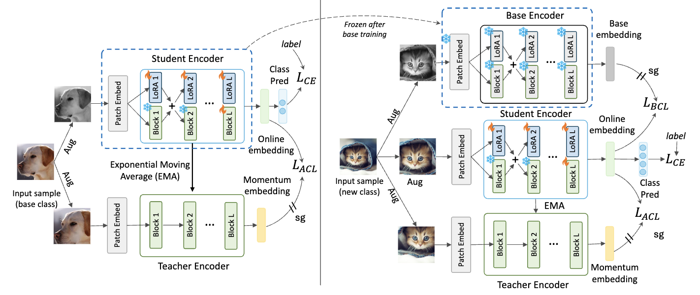
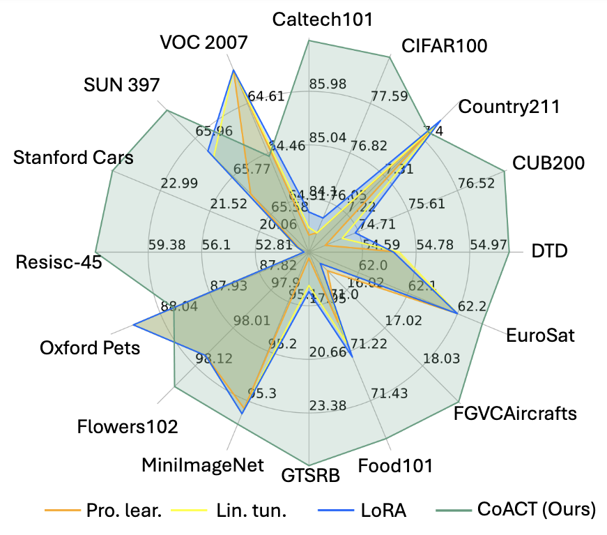
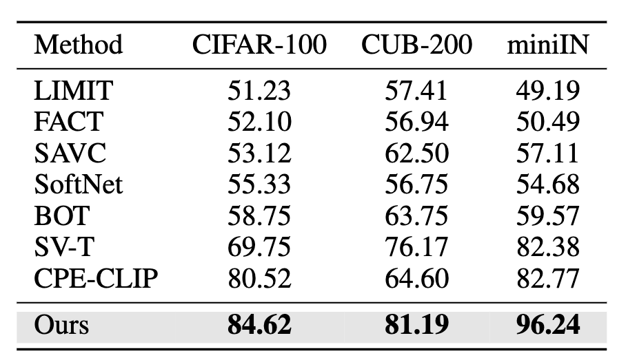

# CoACT

Official implementation of our paper:

> [**Consistency-Guided Asynchronous Contrastive Tuning for Few-Shot Class-Incremental Tuning of Foundation Models**](https://openreview.net/forum?id=WfAvMdwiE8) <br>
> Shuvendu Roy, Elham Dolatabadi, Arash Afkanpour, and Ali Etemad <br> > Transactions on Machine Learning Research (TMLR 2025)

[](https://openreview.net/forum?id=WfAvMdwiE8)

<hr />

[](https://paperswithcode.com/sota/few-shot-class-incremental-learning-on-cub?p=few-shot-tuning-of-foundation-models-for)	
[](https://paperswithcode.com/sota/few-shot-class-incremental-learning-on-mini?p=few-shot-tuning-of-foundation-models-for)
[](https://paperswithcode.com/sota/few-shot-class-incremental-learning-on-cifar?p=few-shot-tuning-of-foundation-models-for)

## Overview



## Getting started

Installing the dependencies

```bash
pip install -r requirements.txt
```

## Prepare Data

14 out of 16 datasets will be downloaded automatically from huggingface datasets.
For CUB-200, and miniImageNet please refer to [CEC](https://github.com/icoz69/CEC-CVPR2021) and downlaod it from [here](https://drive.google.com/drive/folders/11LxZCQj2FRCs0JTsf_dafvTHqFn2yGSN).

Extract the datasets to `./data` folder.

## Experiments

### Resutls

<p align="center">
  
</p>

### Baseline: Prototype Tuning

```bash
for dataset_name in sun397 dtd voc2007 stanford_cars resisc45 oxford_pets oxford_flowers gtsrb fgvc_aircraft eurosat country211 caltech101 cifar100 cub200 food101 mini_imagenet; do

  python train.py \
    --update_base_classifier_with_prototypes True \
    --epochs_base 0 \
    --num_seeds 3 \
    --shot 10 \
    --result_key baseline \
    --dataset "${dataset_name}"

done

```

### CoACT (Ours)

```bash

for dataset_name in sun397 dtd voc2007 stanford_cars resisc45 oxford_pets oxford_flowers gtsrb fgvc_aircraft eurosat country211 caltech101 cifar100 cub200 food101 mini_imagenet; do

  python train.py \
    --update_base_classifier_with_prototypes False \
    --start_training_with_prototypes True \
    --moco_loss_factor 1.0 \
    --epochs_base 50 \
    --num_seeds 3 \
    --num_views 2 \
    --shot 10 \
    --adapt_blocks 12 \
    --hf_model_checkpoint google/vit-base-patch16-224-in21k \
    --pet_cls LoRA \
    --result_key coact_fscit \
    --dataset "${dataset_name}" \
    --incft True

done
```


CoACT also shows superior performance than the prior works on conventional FSCIL setup. Following is the comparison of the results on the CIFAR-100 datasset.

<p align="center">
  
</p>

### Run

```bash
for dataset_name in cifar100 cub200 mini_imagenet; do

  python train.py \
    --fsl_setup "FSCIL" \
    --shot 5 \
    --epochs_base 25 \
    --incft_layers "classifier+pet" \
    --start_training_with_prototypes True \
    --pet_cls LoRA \
    --incft True \
    --result_key act_fscil \
    --num_seeds 3 \
    --dataset "${dataset_name}"

done
```

## Acknowledgement
We would like to thank the authors of the following repositories to make their code public: [MoCo](https://github.com/facebookresearch/moco), [SAVC](https://github.com/zysong0113/SAVC), and [SupCon](https://github.com/HobbitLong/SupContrast).

## Citing CoACT

If you find our work useful to your research, please cite our paper:

```bash
@article{CoACT,
  title={Consistency-Guided Asynchronous Contrastive Tuning for Few-Shot Class-Incremental Tuning of Foundation Models},
  author={Shuvendu Roy, Elham Dolatabadi, Arash Afkanpour, Ali Etemad},
  journal={Transactions on Machine Learning Research},
  year={2025}
}
```
